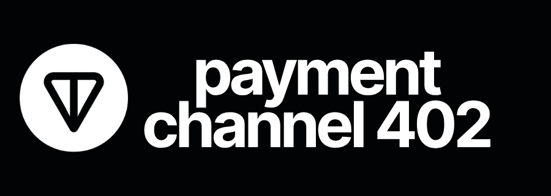

<p align="center">
  
</p>

# Payment Channel 402

TypeScript SDK for off-chain micropayments on TON via payment channels and HTTP 402.

Open a channel on-chain, exchange unlimited signed payments off-chain, close on-chain. Three transactions total, zero gas per payment. Tested E2E on TON mainnet.

## Packages

| Package | Description | Install |
|---------|-------------|---------|
| `pc402-core` | Off-chain signing, HTTP 402 protocol, state management | `npm i pc402-core` |
| `pc402-channel` | On-chain lifecycle, dispute resolution | `npm i pc402-channel` |
| `pc402-fetch` | HTTP client with automatic 402 payment handling | `npm i pc402-fetch` |
| `pc402-cli` | CLI for agents and developers | `npm i -g pc402-cli` |
| `pc402-mcp` | MCP server for AI agents (Claude, Cursor, etc.) | `npm i -g pc402-mcp` |

Peer dependencies: `@ton/core`, `@ton/crypto`, `@ton/ton`.

## Quick Start

### For developers (library)

```bash
npm install pc402-fetch
```

```typescript
import { createPC402Fetch } from "pc402-fetch";

const fetch402 = createPC402Fetch({ keyPair, storage });
const res = await fetch402("https://api.example.com/data");
// 402 Payment Required? Handled automatically.
```

### For AI agents (CLI)

```bash
npm install -g pc402-cli
pc402 fetch https://api.example.com/data --wallet .wallet.json
pc402 channel list --wallet .wallet.json
```

See [packages/cli/README.md](packages/cli/README.md) for all 16 commands.

## MCP Server

pc402-mcp exposes 14 tools to AI agents via the [Model Context Protocol](https://modelcontextprotocol.io).

```bash
npm install -g pc402-mcp
```

```bash
claude mcp add pc402 -- pc402-mcp --wallet /path/to/.wallet.json --rpc https://toncenter.com/api/v2/jsonRPC
```

See [packages/mcp/README.md](packages/mcp/README.md) for Cursor, Windsurf, and VS Code configuration.

### Tools

| Tool | Description |
|------|-------------|
| `pc402_fetch` | Fetch a URL with automatic 402 payment |
| `pc402_balance` | Show off-chain channel balances |
| `pc402_wallet` | Show wallet address and balance |
| `pc402_status` | Read on-chain channel state |
| `pc402_deploy` | Deploy a new channel |
| `pc402_init` | Initialize a channel (UNINITED -> OPEN) |
| `pc402_topup` | Top up a channel with TON |
| `pc402_cooperative_close` | Settle and close a channel |
| `pc402_cooperative_commit` | Partial withdrawal without closing |
| `pc402_start_uncoop_close` | Start dispute (server offline) |
| `pc402_challenge` | Challenge a stale quarantined state |
| `pc402_finish_uncoop_close` | Finalize after quarantine |
| `pc402_pending_commit` | Check pending commit signature |
| `pc402_close` | Remove channel from local storage |

## Flow

### 1. Discovery (HTTP 402)

Client requests a paid resource. Server responds `402` with channel info and price.

```typescript
// Server
const header = buildPaymentRequired({
  price: 1000000n,
  serverPublicKey: serverKP.publicKey,
  serverAddress: "EQ...",
  channelAddress: "EQ...",
  channelId: 1n,
  initBalanceA: 100000000n,
  initBalanceB: 0n,
});
res.status(402).set("PAYMENT-REQUIRED", header).end();

// Client
const req = parsePaymentRequired(header);
```

### 2. Open Channel

Client deploys a payment channel using the info from step 1. Two on-chain transactions.

```typescript
const channel = new OnchainChannel({
  client,
  myKeyPair: keyPairA,
  counterpartyPublicKey: keyPairB.publicKey,
  isA: true,
  channelId,
  myAddress: addressA,
  counterpartyAddress: addressB,
  initBalanceA: toNano("1"),
  initBalanceB: 0n,
});
await channel.deployAndTopUp(senderA, true, toNano("1"));
await channel.init(senderA, toNano("1"), 0n);
```

### 3. Pay (off-chain)

Client pays per-request by signing state updates. Server verifies instantly. Zero gas, sub-millisecond.

```typescript
// Client
state = pc.createPaymentState(state, BigInt(req.amount));
const sig = pc.signState(state);
const paymentHeader = buildPaymentSignature({ state, signature: sig, ... });
fetch(url, { headers: { "PAYMENT-SIGNATURE": paymentHeader } });

// Server
const result = verifyPaymentSignature(paymentHeader, channel, lastState, price, ...);
if (result.valid) {
  const responseHeader = buildPaymentResponse({ counterSignature, ... });
}
```

Repeat per request. Bidirectional. Unlimited.

### 4. Commit (optional)

Server withdraws accumulated funds while the channel stays open. Co-signature exchanged over HTTP via `commitRequest` in `PAYMENT-RESPONSE` and `commitSignature` in the next `PAYMENT-SIGNATURE`.

```typescript
// Server: include commit request in response
const serverSig = serverChannel.signCommit(1n, 1n, sentA, sentB, 0n, withdrawB);
buildPaymentResponse({ counterSignature, commitRequest: { seqnoA: 1, seqnoB: 1, sentA, sentB, withdrawA: 0n, withdrawB, serverSignature: serverSig } });

// Client: verify, co-sign, include in next payment
const clientSig = clientChannel.signCommit(1n, 1n, sentA, sentB, 0n, withdrawB);

// Server: broadcast on-chain
await channel.cooperativeCommit(sender, 1n, 1n, sentA, sentB, clientSig, serverSig, 0n, withdrawB);
```

### 5. Close

Both parties sign the final state. One on-chain transaction distributes all funds. Channel returns to UNINITED (reopenable).

```typescript
const sentA = balanceToSentCoins(initBalanceA, state.balanceA);
const sentB = balanceToSentCoins(initBalanceB, state.balanceB);
const sigA = channel.signClose(BigInt(state.seqnoA), BigInt(state.seqnoB), sentA, sentB, keyPairA);
const sigB = channel.signClose(BigInt(state.seqnoA), BigInt(state.seqnoB), sentA, sentB, keyPairB);
await channel.cooperativeClose(senderA, BigInt(state.seqnoA), BigInt(state.seqnoB), sentA, sentB, sigA, sigB);
```

### 6. Dispute

If the counterparty is unresponsive, force-close via quarantine. The counterparty can challenge with a newer state during the quarantine period.

```typescript
const schA = buildSignedSemiChannel(channelId, seqnoA, sentA, keyPairA);
const schB = buildSignedSemiChannel(channelId, seqnoB, sentB, keyPairB);
const sig = channel.signStartUncoopClose(schA, schB, keyPairA);
await channel.startUncooperativeClose(senderA, true, sig, schA, schB);
// Wait quarantine + close period...
await channel.finishUncooperativeClose(senderA);
```

## Structure

| Path | Package | Description |
|------|---------|-------------|
| `packages/core/` | `pc402-core` | Off-chain signing, HTTP 402, state management |
| `packages/channel/` | `pc402-channel` | On-chain lifecycle, dispute resolution |
| `packages/fetch/` | `pc402-fetch` | HTTP client with auto-402 payment |
| `packages/cli/` | `pc402-cli` | CLI for agents and developers (16 commands) |
| `packages/mcp/` | `pc402-mcp` | MCP server for AI agents (14 tools) |
| `contracts/` | | Payment channel smart contract (Tolk v2.1, 6 files, 36 sandbox tests) |
| `test/e2e/` | | 3 E2E mainnet test suites |

## Smart Contract

Bidirectional payment channel on TON. Two parties lock funds on-chain, exchange unlimited off-chain payments via signed state updates, then settle in one transaction. Supports cooperative close, uncooperative close with quarantine, partial withdrawals, and channel reopen. Source in `contracts/src/`, bytecode embedded in `pc402-channel`. See [contracts/README.md](contracts/README.md) for details.

### Balance Model

Each party has 3 tracked values on-chain: `deposit`, `withdrawn`, `sent`.

| Party | Effective balance |
|---|---|
| A | `depositA + sentB - sentA - withdrawnA` |
| B | `depositB + sentA - sentB - withdrawnB` |

### Channel States

| State | Transition |
|---|---|
| `UNINITED` (0) | deploy + topUp + init -> `OPEN` |
| `OPEN` (1) | cooperativeClose -> `UNINITED` (reopenable) |
| `OPEN` (1) | startUncooperativeClose -> `CLOSURE_STARTED` |
| `CLOSURE_STARTED` (2) | challenge / quarantine expires -> `SETTLING_CONDITIONALS` |
| `AWAITING_FINALIZATION` (4) | finishUncooperativeClose -> `UNINITED` |

### Operations

| Operation | Gas |
|---|---|
| topUp | 0.004 TON |
| initChannel | 0.004 TON |
| cooperativeClose | 0.006 TON |
| cooperativeCommit | 0.005 TON |
| startUncooperativeClose | 0.005 TON |
| challengeQuarantinedState | 0.005 TON |
| finishUncooperativeClose | 0.005 TON |
| **Off-chain payment** | **0 TON** |

## Testing

```bash
npm test                                           # 142 unit + sandbox tests
npm run lint                                       # biome + tsc
npx vitest run -c test/e2e/vitest.config.ts        # 3 E2E mainnet (requires funded wallets + .env)
```

## Why Payment Channels?

Existing solutions pay on-chain per request ([x402](https://github.com/coinbase/x402)) or require trusted hardware ([A402](https://arxiv.org/abs/2503.18732)). Neither works for high-frequency machine-to-machine payments: gas costs eliminate micropayments, block confirmation adds seconds of latency, and hardware dependencies exclude IoT devices.

pc402 locks funds once in a payment channel, then exchanges Ed25519 signatures off-chain. Zero gas per payment. Sub-millisecond verification. Runs on anything from a cloud server to an ESP32 over LoRa. The blockchain is only touched at open and close.

**Use cases:** AI agents paying for API calls without API keys. IoT sensors selling data over LoRa mesh networks without internet. APIs monetized per-request without Stripe. Content paid per-paragraph instead of per-subscription. Vehicles streaming payments for tolls, parking, and charging.

## License

MIT
